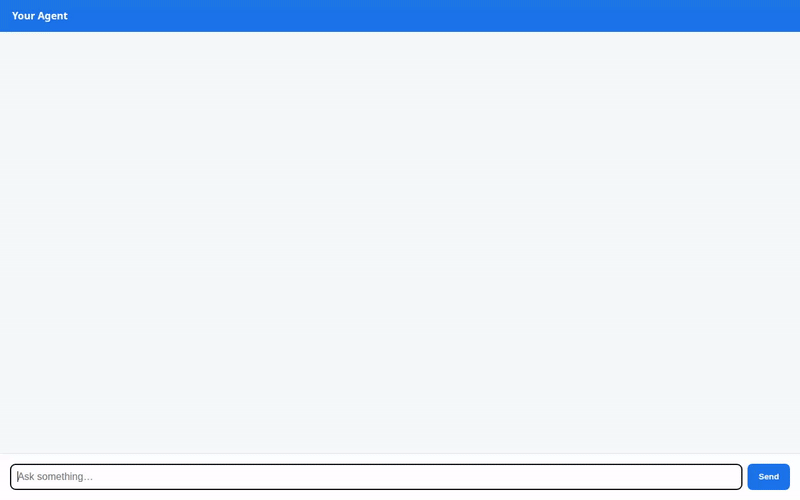

# Travel Concierge Agent

A conversational AI assistant designed to help travelers discover curated destinations, search grounded travel guides, plan trip budgets, and generate visual previews.



---

## Capabilities & Integrated Services

The agent is built using the **Agent Development Kit (ADK)** and integrates the following tools and Google Cloud services:

- **A2UI (Adaptive Agent User Interface)**: Formats response surfaces dynamically into structured, interactive UI components (Cards, Columns, Rows, Text, Image) via custom model output callbacks.
- **Memory Bank**: Retains user preferences, dietary restrictions, and travel constraints across sessions using `PreloadMemoryTool` and automated memory context callbacks.
- **Google Cloud Firestore Catalog**: Performs live queries and updates on the `destinations` Firestore collection (`search_destinations`, `add_destination`).
- **Vertex AI RAG Engine**: Performs grounded semantic search against a Vertex AI RAG Corpus populated with travel reference material (`search_travel_corpus`).
- **Gemini Image Generation & Google Cloud Storage**: Generates travel destination images on-demand using the `gemini-3.1-flash-lite-image` model in Vertex AI, saves session artifacts, and uploads public media directly to Google Cloud Storage (`generate_destination_image`).
- **Google Maps Platform APIs**: Transforms street addresses into latitude/longitude coordinates via the Geocoding API (`geocode_address`, `fetch_location_coordinates`) and retrieves nearby attractions using the Places API (New) REST endpoints (`search_nearby_places`).
- **Itinerary & Travel Utilities**: Provides trip budget calculations based on stay duration (`calculate_itinerary_budget`) alongside weather and local time helpers (`get_weather`, `get_current_time`).

---

## Project Structure

```
.
├── app/
│   ├── agent.py               # Root Agent definition, tool registration, and A2UI instruction
│   ├── a2ui_utils.py          # A2UI callback formatting & data extraction
│   ├── firestore_tools.py     # Firestore destination catalog tools
│   ├── google_maps_tools.py   # Geocoding & Places API (New) REST tools
│   ├── image_tool.py          # Vertex AI image generation & GCS upload tool
│   ├── rag_tool.py            # Vertex AI RAG Corpus retrieval tool
│   ├── location_tool.py       # Geocoding location tool
│   └── budget_tool.py         # Itinerary budget calculator
├── frontend/
│   ├── main.py                # FastAPI proxy connecting to the deployed A2A agent runtime
│   └── static/index.html      # Plain chat frontend with built-in A2UI card rendering
├── agents-cli-manifest.yaml   # Agent manifest configuration
└── demo.gif                   # Demo screen recording
```

---

## Local Setup & Run Instructions

### Prerequisites

- Python 3.10+ and `uv` package manager installed
- Google Cloud project with Google Maps API key set in `GOOGLE_MAPS_API_KEY`

### Running the Agent Playground Locally

To test the agent locally using the ADK Web Playground:

```bash
uv run adk web --port 8080 --allow_origins "*" --reload_agents
```

### Running the Frontend Proxy & Chat UI Locally

To launch the FastAPI proxy and plain web chat interface:

1. Navigate to the `frontend/` directory:
   ```bash
   cd frontend
   ```

2. Set your environment variables:
   ```bash
   export AGENT_ENGINE_RESOURCE_NAME="projects/<PROJECT_ID>/locations/<LOCATION>/reasoningEngines/<ENGINE_ID>"
   export AGENT_DIRECTORY="app"
   export PORT=8080
   ```

3. Start the FastAPI server:
   ```bash
   uv run python main.py
   ```

4. Open your browser to the local server address configured on port 8080.
